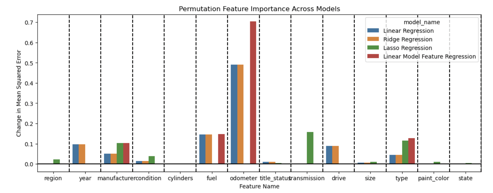
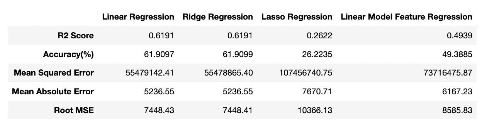

### Practical Application 2 - Used Car Price Predection

[Notebook](https://github.com/)

**OVERVIEW**

In this application, you will explore a dataset from kaggle. The original dataset contained information on 3 million used cars. The provided dataset contains information on 426K cars to ensure speed of processing.  Your goal is to understand what factors make a car more or less expensive.  As a result of your analysis, you should provide clear recommendations to your client -- a used car dealership -- as to what consumers value in a used car.

#### Business Understanding

From a business perspective, we are tasked with identifying key drivers for used car prices. In the CRISP-DM overview, we are asked to convert this business framing to a data problem definition. Using a few sentences, reframe the task as a data task with the appropriate technical vocabulary.

 Our objective is to dertermine the influential factors that impact the pricing of used cars for dealership from given dataset comprising of 426K cars information.

Dealership want to have more insights on the following

- Identify which cars shuould stay away from selling.
- What features in used car will drive the car price up.
- What price should they pay for a car with certain features to maximize their profit margins.

 
#### Assess Situation :

Need to consider following assumptions while predicting car prices. 

- Used Car prices will move in both dirctions. Car prices will go up after car is older after certain point and also based on market conditions(like chips demand was vitnessed during pandamic)
- Car prices will be depending on the condition of the car aswell.
 
#### Data Understanding

After considering the business understanding, we want to get familiar with our data.  We'll explore the steps that we would take to get to know the dataset and identify any quality issues within. 

* Dataset has total 426K records
* 3 numerical and 13 categorical columns were there in dataset
* Over 90% of cars are prices between `500` to `100,000` USD
* Data contain many rows with NaN values. 7 columns are missing more than `20%` of their values
* There are many `price` outliers - over 35K records with price=0 and some cars with prices ober 1 billion dollar
* There are some `odometer` outliers - cars with over 500K miles, some of them with 10 million miles
* There are many duplicate records (almost 200,000) - cars that has the same `VIN ` number with the same odometer, price, mode and  manufactor
* `cylinders` and `condition ` categorical columns can show ordinallity when ranking their unique values

#### Data Cleaning 
* Dropped the `id` column since it's holding a unique identifier that has no predictive meaning
* Dropped the `VIN` column after cleaning the dulicates, since it's just holding a unique identifier that has no predictive meaning
* Dropped the `size` column since it's missing more than `70%` of its data
* Droped Duplicate records 
* Removed `odometer` outliers and focused on cars with `odometer` which is less than 250K miles that is 78.4 % of acutual dataset.
* Removed `price` outliers and focused on cars with `price` between 3,500 and 58,476 USD and data is still 82.74 % of actual data set
* Removed all null values from dataset

#### Data imputation approach
* Leveraged RandomSampleImputer for missing data  and it is fast and keeping the same distribution of data before and after imputation and it is requrued when dealing with 20-30% of missing data.

#### Modelling
Built following models with dataset after data cleaned up with null values and data imputation.

* Linear Regression Model
* Ridge Regression Model
* Lasso Regression Model
* Linear Model with Feature Selection 

I used Permuatatin Feature Imporatnace for both training and test dataset to confirm there is no overfitting in the dataset and identify list of features that have higher impact on determining price of the car.

#### Findings
As shown in the Permutation Featuer Importance, following datapoints were observed.

* odometer is the most important feature when determining price.
* year,manufacture,type,drive and condition are other features taht determines car price

#### Model performance

Following dataframe shows comparision between different model performances.

* Linear Regression and Ridge Regression given same and best R2 score accuracy compared to Lasso and Linear Model Feature Regression
* Linear Regression and Ridege Regression performed better than Lasso and Linear Model Feature Regression

